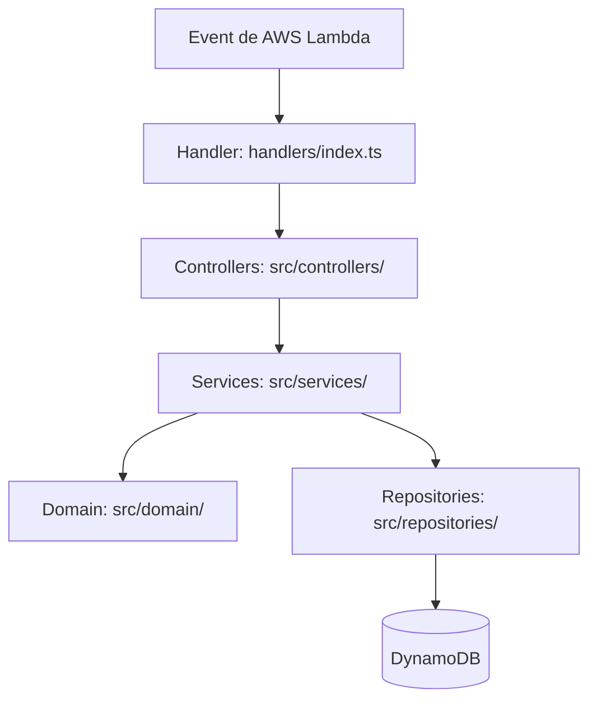

# Documento de Diseño de Software (SDD): JW Service Tracker

Este documento detalla la arquitectura de software, el modelo de datos, los contratos de API, la infraestructura en AWS (Serverless & Cognito) y la interfaz de usuario de la aplicación **JW Service Tracker**.

---

## 1. Arquitectura General del Sistema

La solución adopta una arquitectura monorepo organizada con **pnpm workspaces**:

```mermaid
graph TD
    subgraph Cliente (Front-End)
        SPA[React App / Vite]
    end

    subgraph Backend (AWS Serverless)
        APIGW[API Gateway]
        Cognito[AWS Cognito User Pool]
        Lambda[Lambda única: entriesHandler]
        Dynamo[DynamoDB: EntriesTable]
    end

    SPA <-->|Peticiones HTTP (REST)| APIGW
    APIGW -->|Verifica JWT| Cognito
    APIGW -->|Enruta Peticiones| Lambda
    Lambda <-->|Lectura/Escritura| Dynamo
```

---

## 2. Modelo de Datos y Almacenamiento

### 2.1. Entidades de Datos (`packages/shared`)

#### `PreachingEntry`
Representa un registro individual de predicación.

```typescript
interface PreachingEntry {
  id: string;            // ID autogenerado por el backend (UUID v4) en la creación
  userId: string;        // ID del usuario (Cognito sub)
  preachingDate: number; // Fecha de predicación enviada por el cliente como timestamp UTC en milisegundos (reemplaza a effectiveDate)
  hours: number;         // Horas predicadas (entero >= 0)
  minutes: number;       // Minutos predicados (entero entre 0 y 59)
  type: 'house_to_house' | 'revisits' | 'bible_study' | 'other'; // Tipo de sesión de predicación
  notes?: string;        // Notas/observaciones opcionales
  createdAt: number;     // Milisegundos UTC autogenerados por el backend (capa Repository al crear)
  updatedAt?: number;    // Milisegundos UTC autogenerados por el backend (capa Repository al actualizar)
}
```

### 2.2. Diseño de Base de Datos (DynamoDB)

Se utilizará una única tabla llamada `EntriesTable`.

- **Partition Key (PK)**: `userId` (String)
- **Sort Key (SK)**: `id` (String)

#### Consultas Principales
- **Obtener historial paginado por fecha**: Query sobre el índice secundario global `userIdIndex` (GSI) con `PK = userId`, `SK = preachingDate` y `ScanIndexForward = false` (para orden descendente por fecha, mostrando lo más reciente primero). Se soporta paginación usando `limit` y `nextCursor` (que decodifica el `ExclusiveStartKey` de DynamoDB).
- **Insertar registro**: PutItem con `PK = userId` y `SK = id`. El ID es autogenerado por el backend (UUID v4) y el campo `createdAt` es establecido por la capa de repositorio.
- **Actualizar registro**: PutItem / UpdateItem con `PK = userId` y `SK = id`. El campo `updatedAt` es autogenerado por la capa de repositorio del backend.
- **Eliminar registro**: DeleteItem con `PK = userId` y `SK = id`.

---

## 3. Contratos de la API (CRUD REST)

La Lambda actúa como un monolito serverless y expone los siguientes endpoints para operaciones CRUD independientes, usando los métodos HTTP estándar correspondientes. Todas las peticiones están protegidas por el Autorizador de Cognito.

### 3.1. Obtener entradas (`GET /entries`)
Retorna la lista paginada de entradas de predicación del usuario.
- **Query Parameters**:
  - `limit` (number, opcional, por defecto 50): Cantidad de registros por página.
  - `nextCursor` (string, opcional): Cursor en base64 para obtener la siguiente página de resultados.
- **Headers**: `Authorization: Bearer <JWT_TOKEN>`
- **Respuesta (200 OK)**:
  ```json
  {
    "entries": [
      {
        "id": "a89d-43c2...",
        "userId": "usr-123",
        "preachingDate": 1780768800000,
        "hours": 2,
        "minutes": 30,
        "type": "house_to_house",
        "notes": "Predicación en el territorio comercial",
        "createdAt": 1780768800000,
        "updatedAt": 1780768800000
      }
    ],
    "nextCursor": "eyJ1c2VySWQiOiJ1c3ItMTIzIiwiZGF0ZSI6IjIwMjYtMDYtMDUiLCJpZCI6ImE4OWQtNDNjMi..uLiJ9"
  }
  ```

### 3.2. Crear entrada (`POST /entries`)
Crea un nuevo registro de predicación. El campo `id` y `createdAt` son autogenerados y establecidos por el backend (capa Repository). El frontend no los envía.
- **Headers**: `Authorization: Bearer <JWT_TOKEN>`
- **Request Body**:
  ```json
  {
    "preachingDate": 1780768800000,
    "hours": 2,
    "minutes": 30,
    "type": "house_to_house",
    "notes": "Predicación casa en casa"
  }
  ```
- **Respuesta (201 Created)**:
  ```json
  {
    "id": "a89d-43c2...",
    "userId": "usr-123",
    "preachingDate": 1780768800000,
    "hours": 2,
    "minutes": 30,
    "type": "house_to_house",
    "notes": "Predicación casa en casa",
    "createdAt": 1780768800000
  }
  ```

### 3.3. Actualizar entrada (`PUT /entries/{id}`)
Actualiza un registro de predicación existente por su ID. El campo `updatedAt` es autogenerados y establecido por el backend (capa Repository). El frontend no lo envía.
- **Headers**: `Authorization: Bearer <JWT_TOKEN>`
- **Request Body**:
  ```json
  {
    "preachingDate": 1780768800000,
    "hours": 3,
    "minutes": 0,
    "type": "house_to_house",
    "notes": "Predicación casa en casa - Notas actualizadas"
  }
  ```
- **Respuesta (200 OK)**:
  ```json
  {
    "id": "a89d-43c2...",
    "userId": "usr-123",
    "preachingDate": 1780768800000,
    "hours": 3,
    "minutes": 0,
    "type": "house_to_house",
    "notes": "Predicación casa en casa - Notas actualizadas",
    "createdAt": 1780768800000,
    "updatedAt": 1780769500000
  }
  ```

### 3.4. Eliminar entrada (`DELETE /entries/{id}`)
Elimina físicamente un registro de predicación de la base de datos por su ID.
- **Headers**: `Authorization: Bearer <JWT_TOKEN>`
- **Respuesta (200 OK)**:
  ```json
  {
    "success": true,
    "message": "Entry successfully deleted"
  }
  ```

---

## 5. Diseño de Interfaz y Estética "Cremita" (Tema Claro Cálido)

Siguiendo las directrices estéticas premium y la preferencia por tonos crema, definimos las variables de estilo en Tailwind CSS v3:

### 5.1. Paleta de Colores HSL
- **Fondo Principal (`background`)**: `hsl(36, 60%, 98%)` -> `#fdfbf7` (Crema cálido editorial)
- **Fondo de Tarjetas (`card`)**: `hsl(36, 40%, 96%)` -> `#faf6f0` (Marfil suave y refinado)
- **Texto Principal (`foreground`)**: `hsl(25, 20%, 15%)` -> `#2d241e` (Marrón café oscuro, excelente legibilidad)
- **Color de Acento (`primary`)**: `hsl(24, 55%, 48%)` -> `#b86a3d` (Terracota orgánico)
- **Bordes e Inputs (`border`)**: `hsl(36, 15%, 88%)` -> `#e8e2d9` (Beige arena suave)
- **Muted / Inactivo (`muted-foreground`)**: `hsl(25, 10%, 45%)` -> `#7b726c` (Marrón grisáceo)

### 5.2. Componentes de UI (Shadcn UI adaptado)
- **Botón Primario**: Color terracota de fondo, texto marfil. Efectos de transición suaves en hover (`hover:brightness-95`).
- **Dashboard**:
  - Encabezado elegante con tipografía con serif o sans serif premium (ej: *Playfair Display* o *Outfit* desde Google Fonts).
  - Tarjeta de progreso circular o barra minimalista que muestra la meta de horas del mes actual (ej: "23 de 35 horas").
  - Formulario sencillo con sliders o botones de incremento rápido (+ / -) para registrar datos diarios.
  - Tabla o tarjetas de historial mensual con scroll suave y transiciones fluidas.

---

## 6. Recursos AWS (CloudFormation en serverless.yml)

El archivo de configuración definirá los siguientes recursos administrados:

```yaml
custom:
  stage: ${opt:stage, 'dev'}
  stagePascal:
    dev: Dev
    prod: Prod

resources:
  Resources:
    # 1. Cognito User Pool (kebab-case + ambiente)
    CognitoUserPool:
      Type: AWS::Cognito::UserPool
      Properties:
        UserPoolName: jw-service-tracker-user-pool-${self:custom.stage}
        UsernameAttributes:
          - email
        AutoVerifiedAttributes:
          - email
        Policies:
          PasswordPolicy:
            MinimumLength: 8
            RequireLowercase: true
            RequireNumbers: true
            RequireUppercase: true
            RequireSymbols: false

    # 2. Cognito User Pool Client (kebab-case + ambiente)
    CognitoUserPoolClient:
      Type: AWS::Cognito::UserPoolClient
      Properties:
        ClientName: jw-service-tracker-web-client-${self:custom.stage}
        UserPoolId: !Ref CognitoUserPool
        GenerateSecret: false # Requerido falso para aplicaciones SPA / React
        ExplicitAuthFlows:
          - ALLOW_USER_PASSWORD_AUTH
          - ALLOW_REFRESH_TOKEN_AUTH
          - ALLOW_USER_SRP_AUTH

    # 3. DynamoDB Table (PascalCase + ambiente) con GSI para ordenación por fecha
    EntriesTable:
      Type: AWS::DynamoDB::Table
      Properties:
        TableName: EntriesTable${self:custom.stagePascal.${self:custom.stage}}
        AttributeDefinitions:
          - AttributeName: userId
            AttributeType: S
          - AttributeName: id
            AttributeType: S
          - AttributeName: preachingDate
            AttributeType: N
        KeySchema:
          - AttributeName: userId
            KeyType: HASH
          - AttributeName: id
            KeyType: RANGE
        GlobalSecondaryIndexes:
          - IndexName: userIdIndex
            KeySchema:
              - AttributeName: userId
                KeyType: HASH
              - AttributeName: preachingDate
                KeyType: RANGE
            Projection:
              ProjectionType: ALL
        BillingMode: PAY_PER_REQUEST
```

---

## 7. Arquitectura del Backend (Monolito Serverless)

El backend (BE) se estructurará como un monolito serverless. La aplicación se organiza mediante capas horizontales compartidas (controladores, servicios, repositorios, dominio) y un único handler de entrada que enruta todas las solicitudes HTTP a los controladores correspondientes:



### 7.1. Formato de Nombre de las Lambdas (AWS)
Las funciones Lambda en AWS se nombran utilizando PascalCase e incluyen el ambiente dinámicamente mediante la variable `${self:custom.stagePascal.${self:custom.stage}}` (ej. `EntriesLambdaDev` para desarrollo, o `EntriesLambdaProd` para producción). Esto se define en `serverless.yml`:
```yaml
functions:
  entries:
    name: EntriesLambda${self:custom.stagePascal.${self:custom.stage}}
```

### 7.2. Patrón de Inyección de Dependencias por Props (Singleton como Objeto)
Para evitar constructores posicionales rígidos y permitir una inyección de dependencias scalables:
- Cada clase recibe un único objeto `props` que cumple con una interfaz de propiedades (`Props`).
- Cada capa tiene un archivo `index.ts` que se encarga de instanciar la clase inyectando sus dependencias y exportando el objeto resultante como un singleton.

#### Ejemplo de Estructura de Clases:
```typescript
// Repositorio
export interface DynamoDbEntriesRepositoryProps {
  dbClient: DynamoDBDocumentClient;
  config: {
    entriesTable: string;
  }
}
export class DynamoDbEntriesRepositoryImp implements EntriesRepository {
  constructor(props: DynamoDbEntriesRepositoryProps) { ... }
}

// Servicio
export interface EntriesServiceProps {
  repository: EntriesRepository;
}
export class EntriesServiceImp implements EntriesService {
  constructor(props: EntriesServiceProps) { ... }
}

// Controlador
export interface EntriesControllerProps {
  service: EntriesService;
}
export class EntriesController {
  constructor(props: EntriesControllerProps) { ... }
}
```

### 7.3. Descripción de las Capas

1. **Handlers (`src/handlers/`)**:
   - Es el punto de entrada expuesto a AWS Lambda.
   - Enruta la petición HTTP al método del controlador correspondiente.
   - Importa los singletons de las controladoras directamente de `src/controllers/`.

2. **Controllers (`src/controllers/`)**:
   - Maneja la comunicación y el protocolo HTTP.
   - Recibe y valida los parámetros de entrada de API Gateway (`APIGWProxyEvent`).
   - Envía los datos procesados a la capa de servicios.
   - Formatea la respuesta HTTP final.
   - El archivo `index.ts` instancia y exporta los singletons correspondientes (ej. `entriesController`).

3. **Services (`src/services/`)**:
   - Orquesta la lógica de negocio y las llamadas a la base de datos/APIs externas.
   - Define interfaces para desacoplar y permitir mocks en tests.
   - El archivo `index.ts` instancia y exporta los singletons correspondientes (ej. `entriesService`).

4. **Domain (`src/domain/`)**:
   - Contiene los modelos de negocio y la lógica de negocio pura (validaciones de dominio, cálculos, sumas). No tiene dependencias de infraestructura ni de frameworks de AWS.
   - **Constructor estándar**: Todas las clases de dominio deben tener en su constructor la firma:
     ```typescript
     constructor(data: Partial<NombreClase>) {
       Object.assign(this, data);
     }
     ```
   - **Propiedades**: Las clases de dominio que utilicen `Object.assign(this, data)` en el constructor NO deben utilizar el operador de aserción definitiva `!` en sus propiedades. En su lugar, deben declararse como propiedades opcionales (`?`) o inicializarse por defecto.

5. **Repositories (`src/repositories/`)**:
   - Realiza la comunicación directa con DynamoDB o APIs externas.
   - Define interfaces para desacoplar el acceso a datos.
   - El archivo `index.ts` instancia y exporta los singletons correspondientes (ej. `entriesRepository`).

### 7.4. Estructura de Directorios del Backend (`apps/api`)

```
apps/api/
├── serverless.yml
├── package.json
└── src/
    ├── handlers/
    │   └── index.ts                 # Entrypoint Lambda expuesto en serverless.yml
    ├── controllers/
    │   ├── EntriesController.ts
    │   └── index.ts                 # Instancia y exporta entriesController
    ├── services/
    │   ├── EntriesService.ts
    │   ├── EntriesServiceImp.ts
    │   └── index.ts                 # Instancia y exporta entriesService
    ├── domain/
    │   ├── Entry.ts                 # Lógica de negocio pura (Entry)
    │   └── User.ts                  # Lógica de negocio pura (User)
    └── repositories/
        ├── EntriesRepository.ts
        ├── DynamoDbEntriesRepositoryImp.ts
        └── index.ts                 # Instancia y exporta entriesRepository
```

---

## 8. Reglas de Negocio y Validaciones (Capa Domain)

La clase de dominio `Entry` en `apps/api/src/domain/Entry.ts` se encargará de validar que las entradas sigan las reglas de negocio antes de ser procesadas por el servicio o guardadas en el repositorio:

### 8.1. Reglas de Validación de Entrada
1. **Identificador (`id`)**: No es requerido en la creación (se autogenera en el backend). Para solicitudes de actualización (`PUT`), debe ser proporcionado y validado como un UUID v4 no vacío.
2. **Fecha (`preachingDate`)**:
   - Debe ser un entero positivo y representar un timestamp válido en milisegundos UTC.
   - No puede ser una fecha en el futuro (comparada con la hora actual del sistema).
3. **Tiempo de Servicio (`hours` y `minutes`)**:
   - Ambas variables deben ser enteros mayores o iguales a 0 (`hours >= 0`, `minutes >= 0`).
   - Los minutos deben estar en el rango de `0` a `59` inclusive.
   - El total de minutos (`hours * 60 + minutes`) debe ser mayor a 0. No se permite crear un registro con 0 horas y 0 minutos de servicio.
4. **Tipo de predicación (`type`)**:
   - Es obligatorio y debe coincidir con uno de los valores válidos: `'house_to_house' | 'revisits' | 'bible_study' | 'other'`.
5. **Notas (`notes`)**:
   - Opcional. Si existe, no puede superar los 1000 caracteres para evitar saturación de la base de datos.

---

## 9. Detalles Técnicos de Paginación y Cursor

Para implementar la paginación con cursor en DynamoDB:

1. **Lectura y Decodificación**:
   - El controlador recibe un parámetro opcional `nextCursor` en los Query Parameters del `GET`.
   - Si existe `nextCursor`, se decodifica de Base64 a UTF-8 y se convierte en objeto JSON. Este objeto representará el `ExclusiveStartKey` de DynamoDB.
   - Formato decodificado del `ExclusiveStartKey`:
     ```json
     {
       "userId": "usr-123",
       "preachingDate": 1780768800000,
       "id": "a89d-43c2..."
     }
     ```
   - Este objeto se pasa directamente en los parámetros de la consulta a DynamoDB: `ExclusiveStartKey: exclusiveStartKey`.

2. **Generación del Siguiente Cursor**:
   - Al ejecutar el Query sobre DynamoDB con un `Limit`, DynamoDB puede devolver un objeto `LastEvaluatedKey`.
   - Si `LastEvaluatedKey` está presente en la respuesta de DynamoDB:
     - Se serializa a JSON: `JSON.stringify(LastEvaluatedKey)`.
     - Se codifica en Base64: `Buffer.from(jsonStr).toString('base64')`.
     - El string resultante se envía como el campo `nextCursor` en la respuesta JSON de la API.
   - Si no hay más registros (`LastEvaluatedKey` es indefinido), `nextCursor` se retorna como `null` u omite.

---

## 10. Gestión de Errores y Códigos HTTP

La capa de controladores interceptará los errores y devolverá respuestas HTTP estándar con códigos semánticos:

| Código HTTP | Escenario | Formato del Error |
| :--- | :--- | :--- |
| **400 Bad Request** | Datos inválidos o faltantes en el payload, error de validación de dominio. | `{ "error": "VALIDATION_ERROR", "message": "Los minutos deben estar entre 0 y 59" }` |
| **401 Unauthorized** | Token Cognito JWT inválido, expirado o ausente en el header `Authorization`. | `{ "error": "UNAUTHORIZED", "message": "Token inválido o expirado" }` |
| **403 Forbidden** | El `userId` del registro o ruta no coincide con el `sub` del token Cognito JWT. | `{ "error": "FORBIDDEN", "message": "No tienes permisos para modificar este recurso" }` |
| **404 Not Found** | El registro que se intenta eliminar o modificar no existe en DynamoDB. | `{ "error": "NOT_FOUND", "message": "El registro de predicación no existe" }` |
| **500 Internal Server Error** | Excepciones imprevistas, fallos de conexión con DynamoDB, etc. | `{ "error": "INTERNAL_SERVER_ERROR", "message": "Ocurrió un error inesperado en el servidor" }` |

---

## 11. Plantilla de Exportación para WhatsApp

La aplicación en el FE contendrá una utilidad para dar formato de texto plano (utilizando markdown de WhatsApp) a los totales del mes para facilitar su envío al secretario:

```text
📖 *Informe de Actividad*
📅 *Mes:* [Nombre del Mes] [Año]
👤 *Publicador:* [Nombre del Usuario]

⏱️ *Total de horas:* [Ej: 48]

Generado por *JW Service Tracker*
```

---

## 12. Despliegue del Frontend y Alojamiento (AWS Amplify)

El frontend de la aplicación web (React SPA) se alojará y desplegará utilizando **AWS Amplify Hosting**.
* **Gestión de Configuraciones y Secretos:** Las variables de entorno necesarias para conectar la SPA con el backend (como `COGNITO_USER_POOL_ID`, `COGNITO_APP_CLIENT_ID` y `API_GATEWAY_URL`) se inyectarán de forma segura como variables de entorno en la consola de AWS Amplify durante la fase de compilación del frontend.
* **Flujo de Integración Continua:** Cada push a la rama principal (ej. `main`) en el repositorio disparará la reconstrucción y el despliegue automático del sitio estático en Amplify.

---

## 13. Integración de la Autenticación en la App (Amplify SDK)

Para interactuar con AWS Cognito en el frontend, se utilizará la **librería oficial de AWS Amplify SDK** (`@aws-amplify/auth`).
* **Responsabilidades del SDK en el Cliente:**
  * Administración del flujo completo de inicio de sesión, registro y restablecimiento de contraseña.
  * Almacenamiento seguro del token JWT en el cliente y renovación automática del Session/Access Token utilizando el `RefreshToken`.
  * Inyección del encabezado `Authorization: Bearer <JWT>` en las peticiones HTTP al endpoint `/entries`.

---

## 14. Observabilidad, Monitoreo y Políticas de Límites

* **Monitoreo e Historial de Ejecución:** Para la depuración del backend, se utilizará la configuración por defecto de AWS CloudWatch. Las trazas de logs de AWS Lambda (mensajes de `console.log` y errores no controlados) se escribirán automáticamente en los grupos de logs de CloudWatch sin estructuración compleja externa.
* **Límites de Peticiones y Control de Consumo (API Gateway):** No se configurarán políticas personalizadas de límites de peticiones (Throttling o Rate Limiting) adicionales en API Gateway. Se operará bajo la cuota y límites estándar proporcionados por defecto por AWS.
